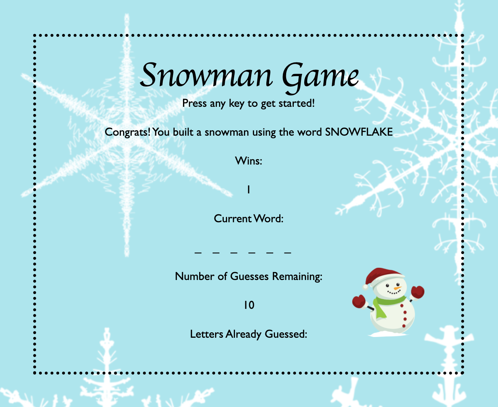
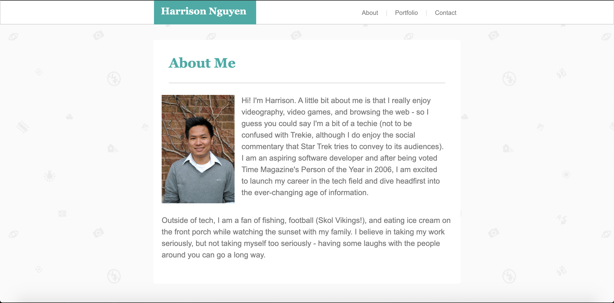
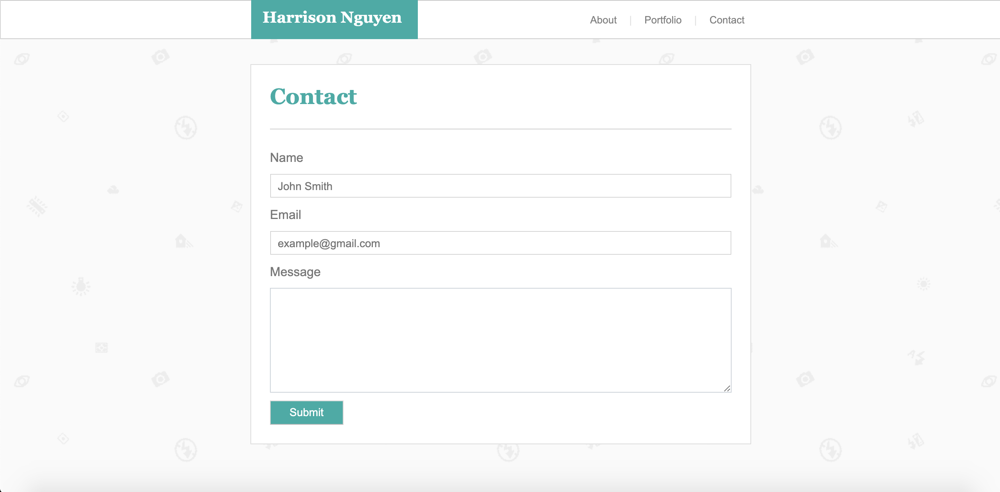
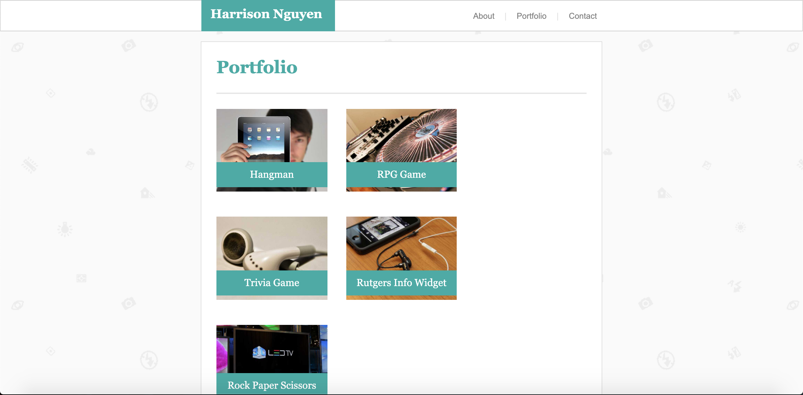

# Harrison Nguyen Prework

This is Harrison Nguyen's repository that holds all prework assessments for Genesis10.

Duration: 2 weeks

All of the projects within this reposity was built within 2 weeks time - culminating with a guessing word game built in vanilla JavaScript and styled primarily with CSS. The game is structured as an object with global variables and a few event listeners. You can find my code within the assests folder inside of the javascript folder. I started by flowcharting all the features that were required within the game and utilized online resources like w3schools, developer.mozilla, and stack overflow to find built-in functions and methods. Feel free to contact me via GitHub if you have any questions about my code.  

## Scrennshots

### Module 2 Assessment

### Module 1 Assessment
#### About Me

#### Contact

#### Portfolio

### CSS Assessment

### HTML Basic CSS Assessment

## Usage 
- Most of the projects are static applications with the Snowman word guessing game being the only dynamic app.
  - To test out the game, launch the source code in your browser and press any key to begin.
  - The game has a winter theme that allows you ten tries to guess the hidden word.
  - Incorrect letters will be displayed, while guessing the word comepletely correctly will give you a tally in the wins collumn. 
  - The game will display the previous hidden word and will continue giving you words until you quit or fresh your browser.

## Built With
- CSS
- Boostrap
- JavaScript

